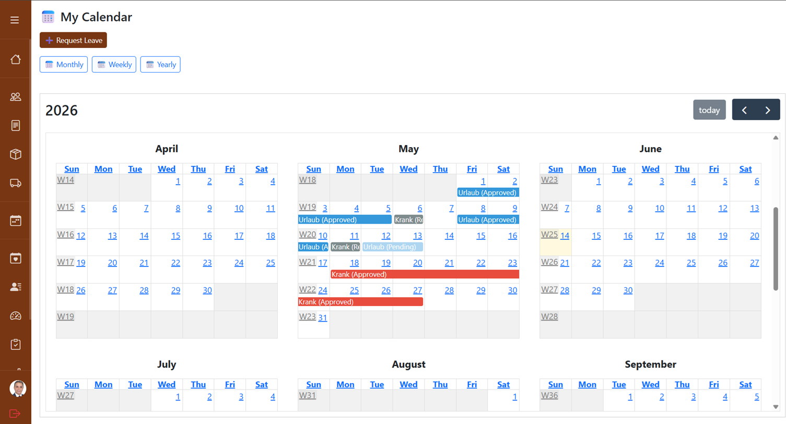
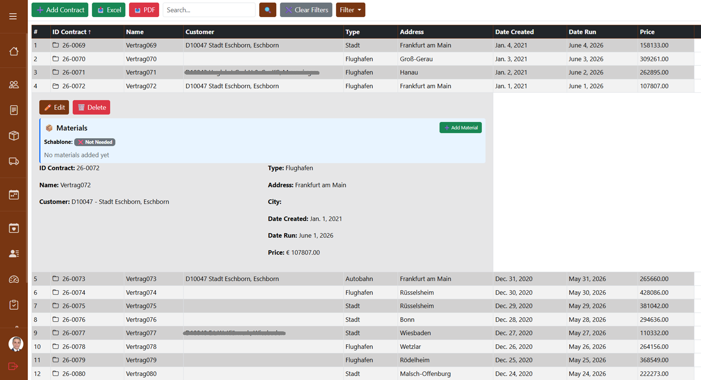
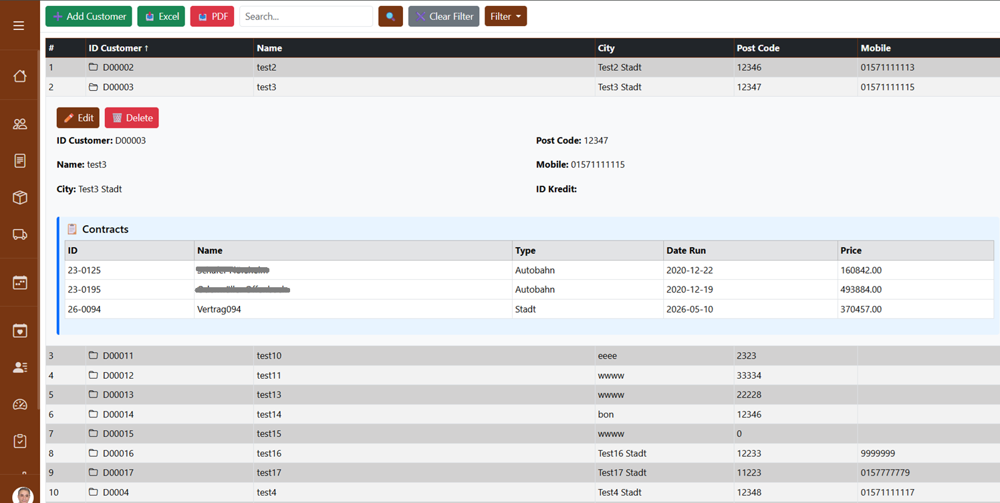
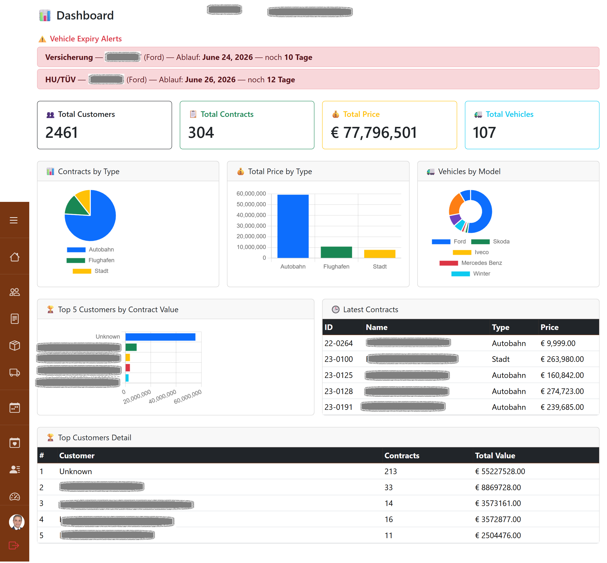
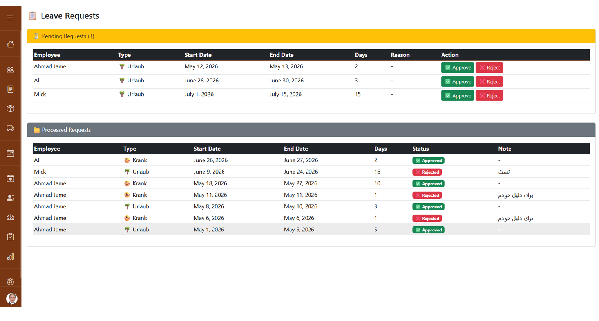
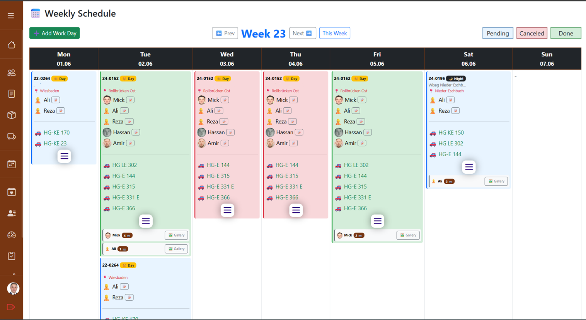
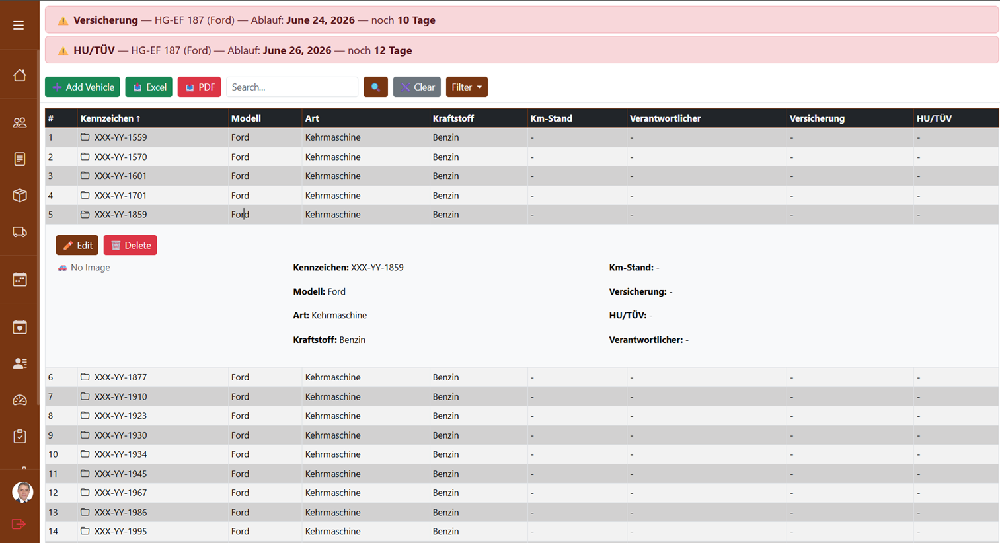
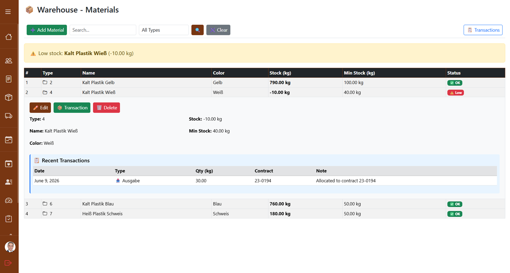
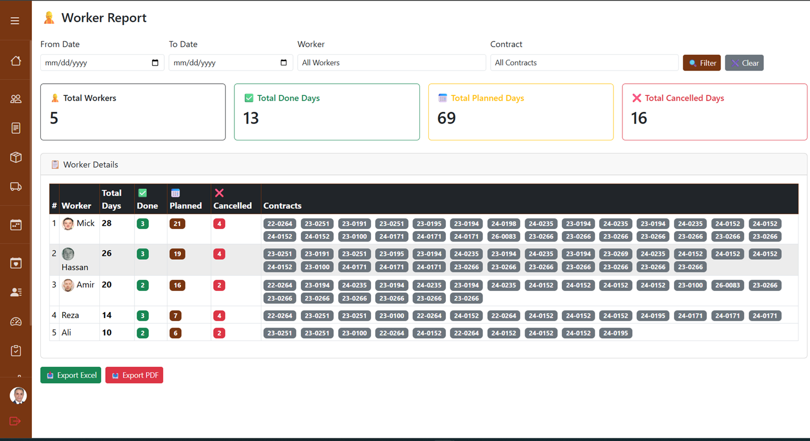

# Markierungs-Manager 🛣️

A web-based business management application for road marking companies in Germany.

## Features
- 📋 Contract & Customer Management
- 📅 Weekly Schedule Planning
- 👷 Worker Management & Reports
- 🚗 Vehicle Fleet Management
- 📦 Warehouse & Material Tracking
- 🌤️ Weather Integration (OpenWeatherMap)
- 📸 Work Reports with Photo Upload
- ⚙️ Company Settings & Customization

## Tech Stack
- **Backend:** Django 4.2
- **Frontend:** Bootstrap 5, JavaScript
- **Database:** SQLite
- **APIs:** OpenWeatherMap

## Installation
1. Clone the repository
2. Create virtual environment: `python -m venv .venv`
3. Activate: `.venv\Scripts\activate`
4. Install packages: `pip install -r requirements.txt`
5. Copy `.env.example` to `.env` and fill in values
6. Run migrations: `python manage.py migrate`
7. Start server: `python manage.py runserver`

## Environment Variables
Create a `.env` file based on `.env.example`:

## Screenshots

### My Calendar

### Contracts

### Customers

### Dashboard

### Leave Request

### Weekly Schedule

### Vehicles

### Warehouse

### Worker Report

